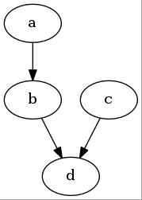

## Graphviz快速入门

#### graphviz简介

​	本文介绍一个高效而简洁的绘图工具`graphviz`。`graphviz`是贝尔实验室开发的一个开源的工具包，它使用一个特定的`DSL`(领域特定语言): `dot`作为脚本语言，然后使用布局引擎来解析此脚本，并完成自动局。`graphviz`提供丰富的导出格式，如常用的图片格式，SVG，PDF格式等。

#### dot语法

+ 注释

  ```
  // 注释
  ```

+ 有向图

  + 使用`digraph`定义有向图
  + 使用`->`表述节点之间的关系

+ 无向图

  + 使用`digraph`定义有向图
  + 使用`->`表述节点之间的关系

+ 节点之间的关系

  + 有向图:

     `a -> b`, a节点指向b节点

  + 无像图:

     `a -- b`, a节点与b节点连通

+ 定义节点属性

  ​	定义属性, 格式为: `node[attribute1=value1, attribute2=value2]`

  ```
  //定义a节点为长方形, 节点显示的文本为"Hello world"样式为填充, 填充颜色为#ABACBA
  a[shape=box,label="Hello world",style=filled,fillcolor="#ABACBA"];
  ```

+ 定义关系属性(即连接两个节点之间的线的样式)

+ 定义节点的形状

  详细参考[node-shapes](http://www.graphviz.org/content/node-shapes)

+ 颜色

  详细参考[color-names](http://www.graphviz.org/content/color-names)

#### 例子

+ 要绘制一个有向图，包含4个节点`a,b,c,d`。其中`a`指向`b`，`b`和`c`指向`d`

  ```
  digraph abc{
    a;
    b;
    c;
    d;

    a -> b;
    b -> d;
    c -> d;
  }
  ```

  生成图形

  ```
  dot ex1.dot -o ex1.png -Tpng
  dot ex1.dot -o ex1.jpg -Tjpg
  ```

  ​

+ 修改节点形状

  ​

#### 参考资料

+ [Documentation](http://www.graphviz.org/Documentation.php)


+ [http://graphs.grevian.org/](http://graphs.grevian.org/)
+ [使用 Graphviz 生成自动化系统图](https://www.ibm.com/developerworks/cn/aix/library/au-aix-graphviz/)
+ [使用graphviz绘制流程图](http://icodeit.org/2015/11/using-graphviz-drawing/)
+ [程序员的绘图利器 graphviz](http://www.jianshu.com/p/855ededf5c7f)
+ [graphviz dot语言学习笔记](http://www.jianshu.com/p/e44885a777f0)
+ [dotguide](http://www.graphviz.org/pdf/dotguide.pdf)